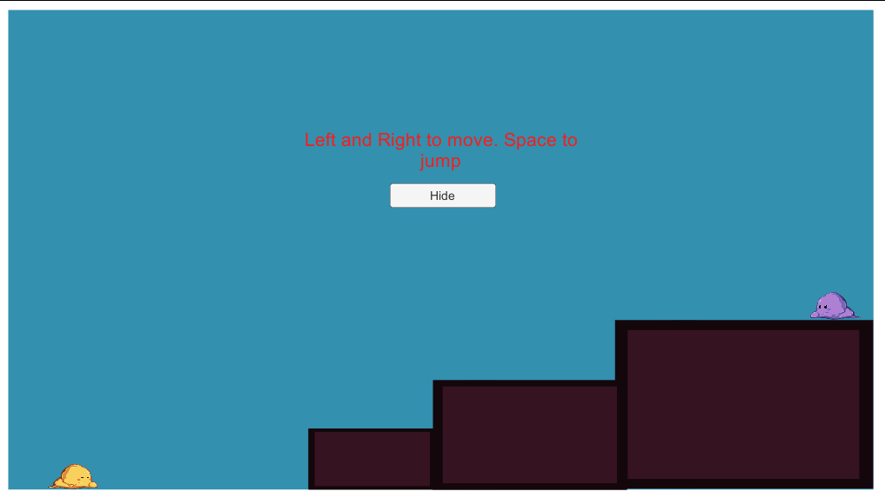
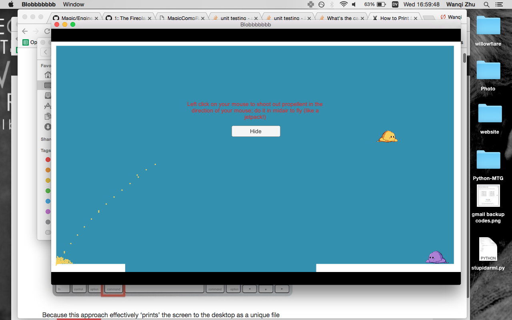
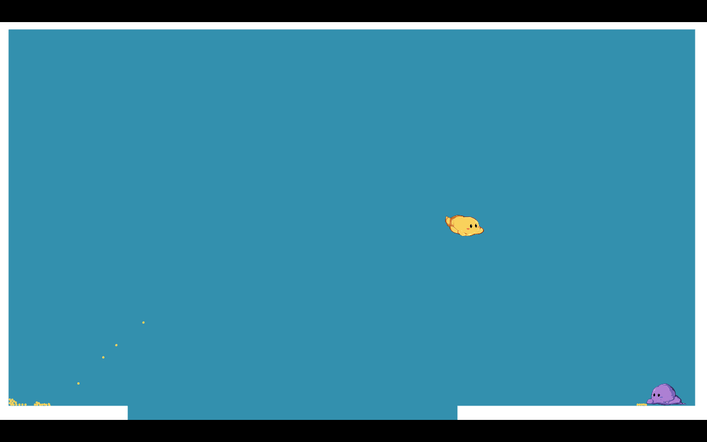
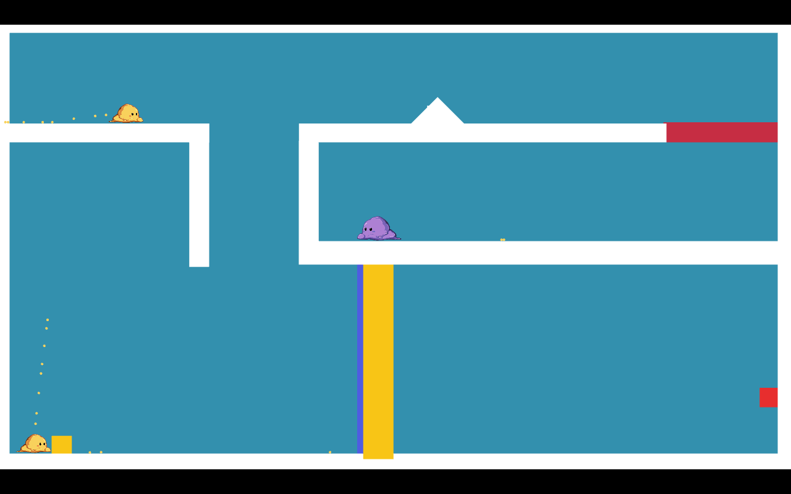
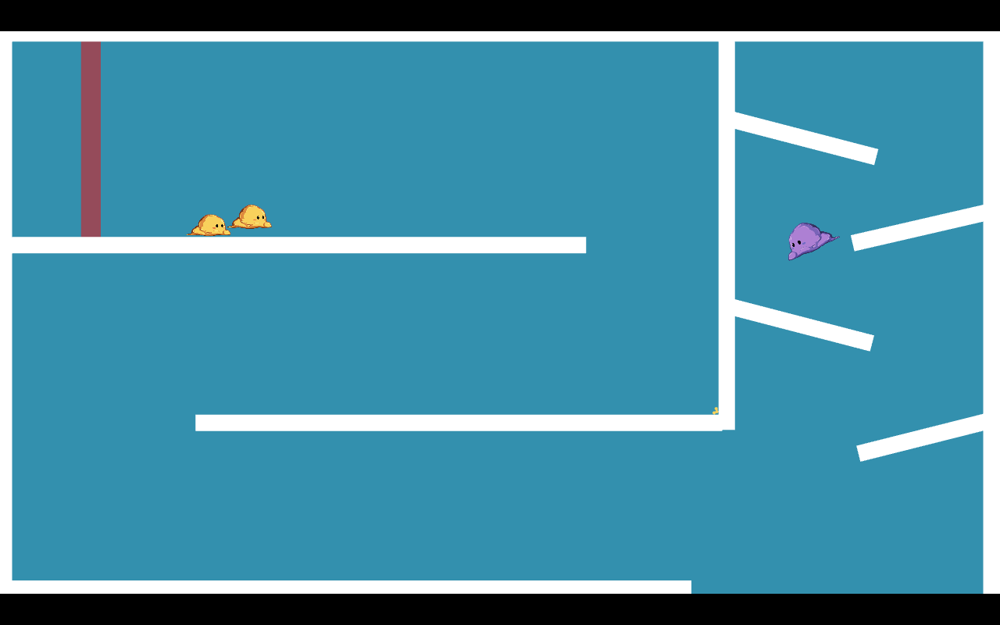

## BlobQuest: 2D Platformer made in Unity

Help Sherbet find his friend by navigating a maze of platforms!

As you unlock more levels, gain the ability to split in half, propel, and fly!
Manipulate buttons and your own mass to reach your friend and unlock high scores!

Senior Project with jkaplan and jliu

[Download Link (for Mac)](https://jkaplan.itch.io/blobquest)

[Download Link (for Mac)](https://jkaplan.itch.io/blobquest)